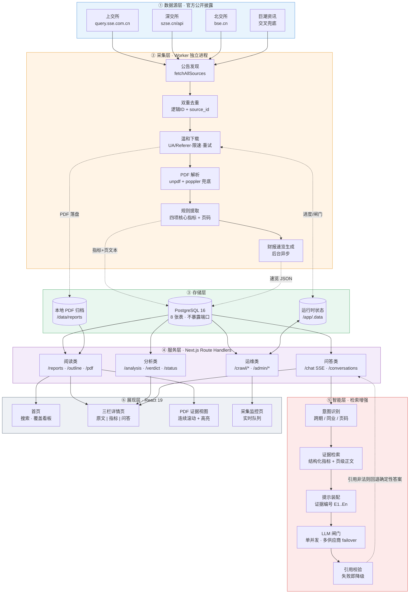
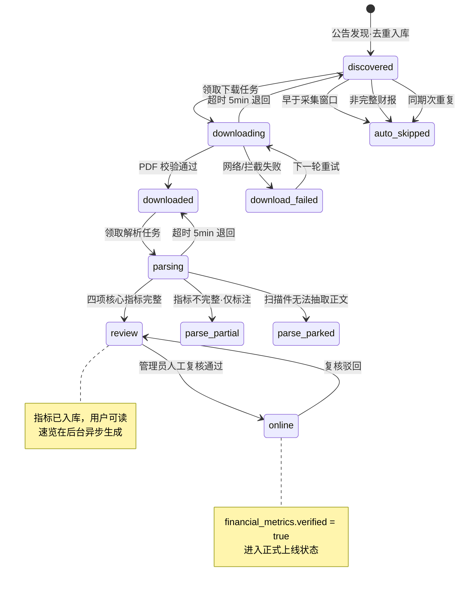
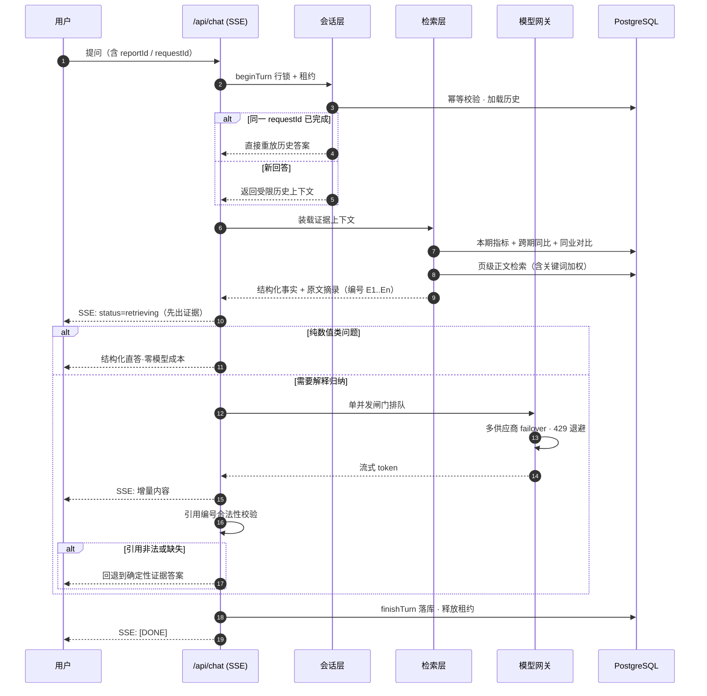
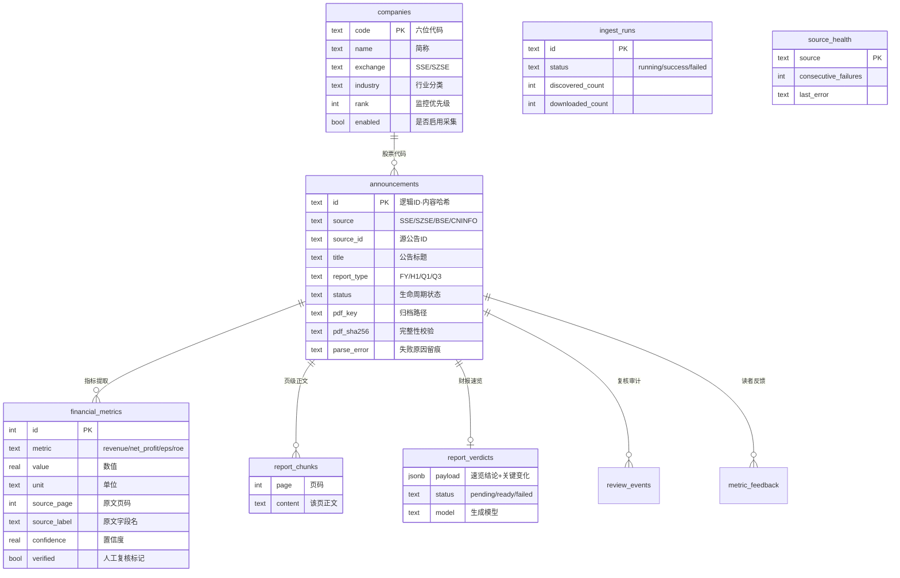
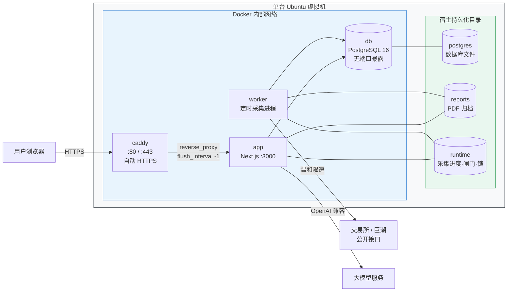

# 财报智析台 · 系统架构说明

> 面向 A 股上市公司财报的智能阅读与分析平台。核心主张：**问财报，有出处** —— 每一个数字、每一条结论都可回溯到官方 PDF 的具体页码。

---

## 一、总体架构图

---

## 二、采集与解析流水线（状态机）

公告从发现到可阅读的完整生命周期。**异常不自动上线**：无法完整抽取时保留"部分解析"状态，而非填充猜测数据。

**关键设计点**

| 环节 | 做法 | 目的 |
|---|---|---|
| 公告发现 | 交易所为主源，巨潮交叉兜底；三源顺序拉取 | 单源变更或限流不中断整体采集 |
| 去重 | `逻辑ID = sha256(代码\|日期\|归一化标题)` + `(source, source_id)` 唯一键 | 同一公告多源发布只入库一次 |
| 下载合规 | 明确 UA、来源页 Referer、可配置间隔、小批量、失败下轮再试 | 温和抓取，不绕过验证码或访问控制 |
| 解析 | `unpdf` 优先，大文件/字体异常时降级 `poppler-utils` | 中文 PDF 字体不暴露 Unicode 时仍可提取 |
| 指标提取 | 确定性规则定位字段名 + 单位换算，保留 `source_page` / `source_label` | 可追溯，非模型猜测 |
| 自愈 | `recoverStaleRuns()` 回收超时任务与中断轮次 | Worker 重启不丢任务 |

---

## 三、智能问答链路（RAG）

问答**不访问未入库的外部数据**，不提供投资建议。模型只负责在给定证据范围内解释，数值与计算由服务端结构化数据完成。

**可信度保障机制**

- **证据先行**：检索结果在模型输出之前就推送给前端，用户始终能看到依据。
- **引用强制校验**：答案中的 `【E1】` 编号必须属于本轮证据集，否则整段回退到确定性答案。
- **口径约束**：同比仅当报告期后缀相同（2026Q1 对 2025Q1）；年报与季报可作参考但不得称为同比。
- **越界拒答**：涉及买卖建议、股价预测，或询问未入库年份时，明确回答"暂无法回答"并说明可核验范围。
- **成本控制**：数值类问题走结构化直答路径，完全不调用模型。

---

## 四、数据模型

**8 张表分三类职责**：业务主数据（`companies` / `announcements` / `financial_metrics` / `report_chunks`）、AI 产出（`report_verdicts` / `chat_conversations` / `chat_messages`）、运行与审计（`ingest_runs` / `source_health` / `review_events` / `metric_feedback`）。

---

## 五、部署架构

单虚机 Docker Compose 交付，四个服务。数据库不对外暴露端口，仅容器网络内可达。

| 服务 | 职责 | 关键配置 |
|---|---|---|
| `caddy` | 反向代理 + 自动申请续期证书 | `flush_interval -1` 保障 SSE 流式不被缓冲 |
| `app` | 页面渲染 + API + RAG 编排 | `output: standalone` 精简运行时 |
| `worker` | 定时发现、下载、解析、速览 | 独立进程，与 Web 请求互不阻塞 |
| `db` | 全部结构化数据 | 仅容器网络可达，独立数据卷 |

**平移边界**：应用只有两处基础设施适配 —— `lib/db.ts`（数据库连接）与 `lib/storage.ts`（文件存储）。迁移到企业 PostgreSQL 与对象存储时只需替换这两层并迁移数据目录，采集、解析、API 与页面无需改动。

---

## 六、技术栈

| 层次 | 选型 |
|---|---|
| 前端 | React 19 · Next.js 16 (App Router) · Tailwind CSS 4 · react-markdown |
| 服务端 | Next.js Route Handlers · SSE 流式输出 |
| 数据库 | PostgreSQL 16 · postgres.js 驱动（参数化查询） |
| PDF 处理 | unpdf（主）· poppler-utils（中文字体兜底） |
| 模型接入 | OpenAI 兼容协议 · 多供应商 failover · 全局单并发闸门 |
| 采集 | 原生 fetch · 分页收集 · 可配置限速与退避 |
| 部署 | Docker Compose · Caddy 自动 HTTPS · 单虚机交付 |
| 质量 | Node 原生测试运行器（116 项单元测试）· ESLint · TypeScript 严格模式 |

---

## 七、架构设计要点小结

1. **可追溯优先于智能化** —— 指标的原始字段名、页码、置信度与人工复核标记全部入库，答案引用编号强制校验，校验失败即降级为确定性证据展示。
2. **采集与服务解耦** —— Worker 独立进程承担全部耗时任务，Web 请求路径不做爬取与解析，页面响应不受采集波动影响。
3. **状态透明不粉饰** —— 已上线、待复核、部分解析、已搁置逐一如实展示；失败原因留痕于 `parse_error`，不以模拟数据填补缺口。
4. **成本自觉** —— 数值类问题走零模型成本的结构化直答；速览按报告缓存复用；LLM 调用受全局闸门约束并具备多供应商容错。
5. **合规采集** —— 明确身份标识、低频小批量、失败退避重试，不绕过任何访问控制机制。
6. **可平移** —— 基础设施耦合面收敛在两个适配模块，具备向企业级数据库与对象存储演进的能力。
